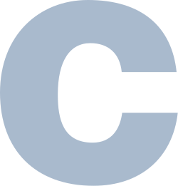

# 💻 C Programming Roadmap: From Beginner to Pro

An open-source, structured, visual, and beginner-friendly path to mastering the C programming language. Start from zero and build real-world, system-level C programs.

 <!-- Optional: Add your own image -->

---

## 📚 Table of Contents

- [🚀 Overview](#-overview)
- [📁 Project Structure](#-project-structure)
- [🛠️ Setup & Requirements](#️-setup--requirements)
- [🧠 Learning Stages](#-learning-stages)
  - [Stage 0: Preparation](./stage-0/)
  - [Stage 1: Foundations of C](./stage-1/)
  - [Stage 2: Control Flow & Logic](./stage-2/)
  - [Stage 3: Functions & Modular Programming](./stage-3/)
  - [Stage 4: Data Handling & Memory Mastery](./stage-4/)
  - [Stage 5: Data Structures](./stage-5/)
  - [Stage 6: Advanced C](./stage-6/)
  - [Stage 7: Projects & Real-World](./stage-7/)
- [📸 Visual Resources](./visuals/)
- [💬 Contributing](#-contributing)
- [📄 License](#-license)

---

## 🚀 Overview

This project is a comprehensive learning path for anyone wanting to master **C Programming** from scratch — inspired by the classics like *K&R*, modern practices, and real-world projects.

Whether you're a student, hobbyist, or aspiring systems programmer — this roadmap is for **you**.

---

## 📁 Project Structure

---
C-Roadmap/
│
├── README.md
├── LICENSE
├── CONTRIBUTING.md
│
├── stage-0/
│   └── README.md
│
├── stage-1/
│   └── README.md
│
├── stage-2/
│   └── README.md
│
├── stage-3/
│   └── README.md
│
├── stage-4/
│   └── README.md
│
├── stage-5/
│   └── README.md
│
├── stage-6/
│   └── README.md
│
├── stage-7/
│   └── README.md
│
├── assets/
│   ├── memory-layout.png
│   └── visuals/
│       └── stage1-flowchart.png
---
   └── README.md
│
├── stage-6/                  ← Advanced topics: File IO, macros, sys calls
│   └── README.md
│
├── stage-7/                  ← Real-world projects, challenges
│   └── README.md
│
├── assets/                   ← Static files: logos, icons, diagrams
│   ├── memory-layout.png
│   └── visuals/              ← Visual explanations (charts, infographics)
│       └── stage1-flowchart.png

## 🛠️ Setup & Requirements

- OS: Windows / Linux / macOS
- C Compiler: `GCC` / `MinGW` / `TDM-GCC`
- Recommended Editor: `VS Code`, `Code::Blocks`, or `Dev-C++`

---

## 🧠 Learning Stages

This roadmap is divided into **7 major stages**, each with bite-sized folders, notes, code snippets, and projects.

Click into any stage folder to start learning.

> You can also open the repo in GitHub Codespaces or clone it locally to follow along.

---

## 💬 Contributing

Want to improve the roadmap, fix a typo, or add resources?
We welcome contributions! 🙌

Please read [CONTRIBUTING.md](./CONTRIBUTING.md) before submitting pull requests.

---

## 📄 License

This project is licensed under the [MIT License](./LICENSE).  
Feel free to fork, remix, and share it with the world.

---

## ⭐ Support

If you found this helpful, consider starring ⭐ this repo or sharing it with friends who want to learn C!

---

